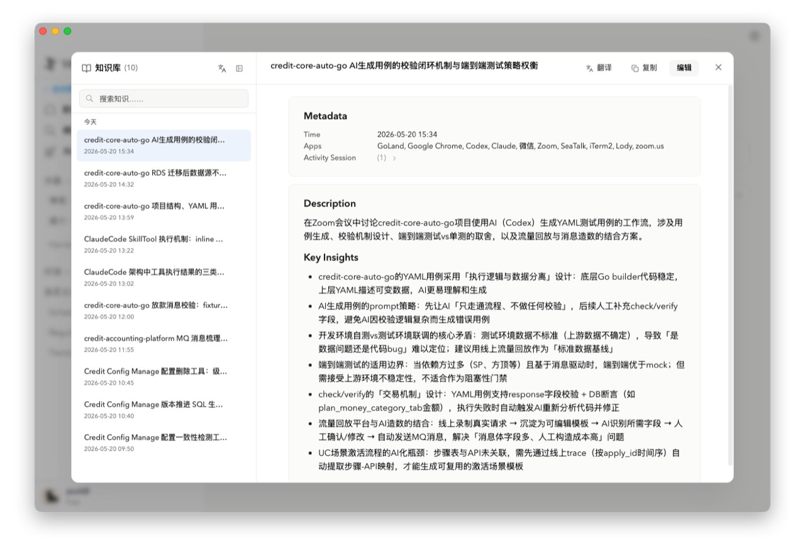
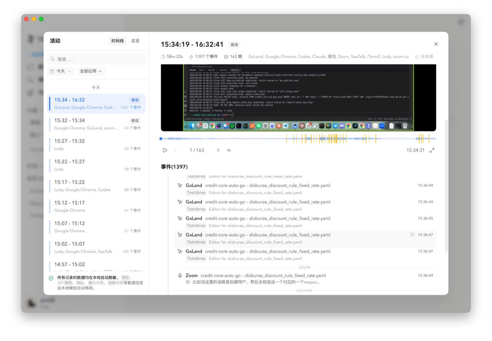
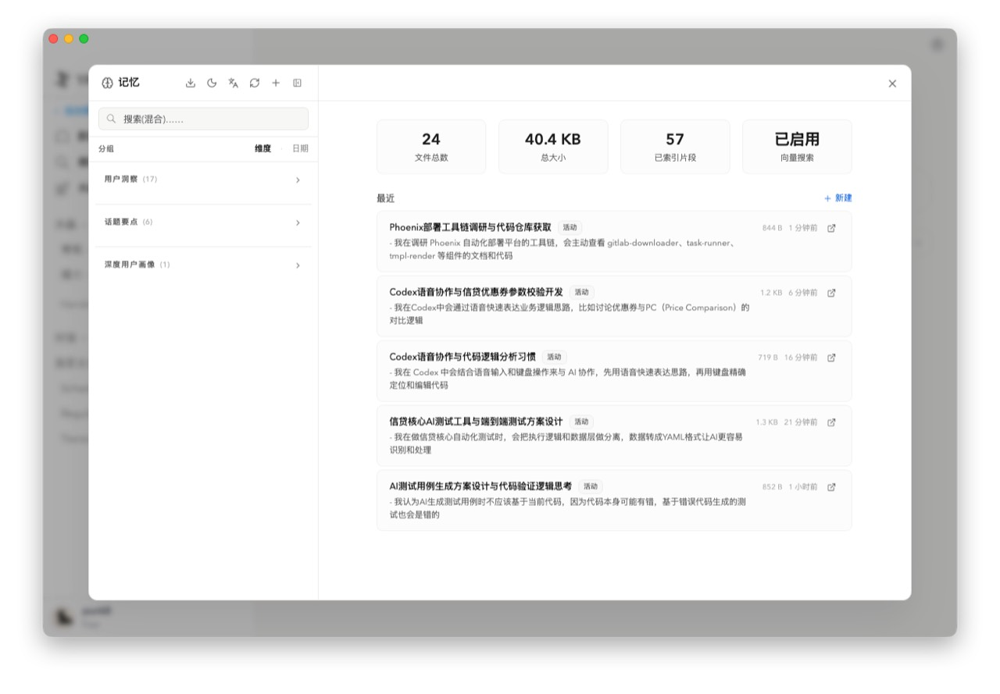
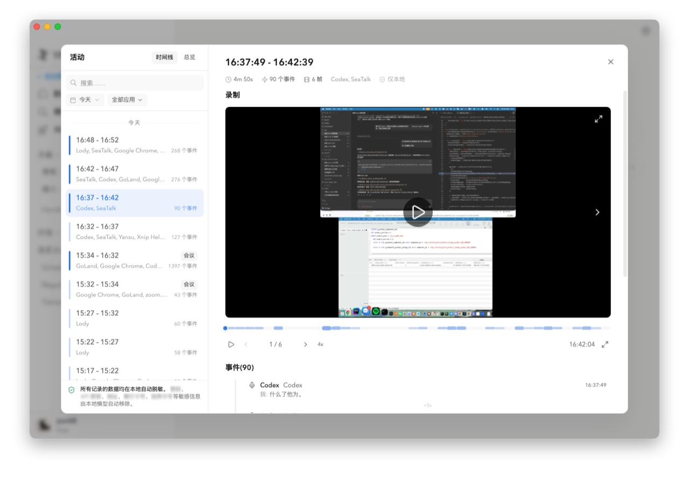

# UI Design

## 观察范围与边界

本文件基于对本机 `/Applications/Yansu.app` 的只读 UI 观察，以及少量本地 CLI / 数据结构只读补充。观察过程中没有创建、编辑、删除、发送、登录、同步、安装、注册、写入记忆或修改任何 Yansu 数据。

为避免泄露私人内容，本文只抽象 UI 结构、控件布局、产品机制和设计结论，不记录具体工作内容、会话标题、知识条目正文或记忆正文。

观察来源标注：

- **真实 UI 观察**：通过 Computer Use 直接观察 Yansu macOS 主窗口、用户菜单、活动页、知识库页、记忆页和设置页。
- **本地结构补充**：通过只读 CLI / 数据结构理解 Activity、Knowledge、Memory 的字段含义和长期数据模型。
- **产品建议**：面向 Orbit 的信息架构和 Electron UI 设计，不等同于 Yansu 当前实现。

## Yansu 参考图归档

以下四张图来自用户提供的 Yansu 应用参考截图，用作 Orbit 下一阶段还原 Activity / Knowledge / Memory / Handoff 工作模式的视觉约束。它们只用于内部产品设计对齐，不代表要逐像素复制 Yansu，也不应把图中具体工作内容当成 Orbit 的数据样例。

### Knowledge Detail



这张图约束 Knowledge Artifact 的目标形态：左侧是可搜索、按时间排列的知识文档列表；右侧是可审阅的 Markdown-like 文档详情，固定包含 Metadata、Description、Key Insights，并把 Activity Session 作为来源入口。Orbit 的 Knowledge 页面应优先成为“可读、可复制、可追溯、可编辑”的知识文档库，而不是只展示摘要卡片。

### Activity Timeline With Event Stream



这张图约束 Activity 的证据层体验：左侧按时间段列出 Activity Session，右侧同时展示录制 / 快照预览、时间轴 scrubber、帧数、事件数、涉及应用、本地状态和事件流。Orbit 的 Activity 页面应回答“发生了什么、证据在哪里、这段工作如何还原”，而不是把截图或 OCR 文本做成孤立搜索结果。

### Memory Overview



这张图约束 Memory 的治理台形态：左侧按维度管理长期记忆，右侧展示文件数、大小、索引片段、向量搜索状态和最近记忆。Orbit 的 Memory 页面需要体现长期事实层的可治理性，包括维度、来源、索引状态、确认状态、版本历史和删除 / 重新索引边界。

### Activity Playback



这张图约束 Activity Playback 的“现场还原”能力：用户应能从 session 列表进入一个具体工作片段，看到录制画面、播放控制、帧进度、事件流和本地存储提示。Orbit 可以先实现低频截图 + OCR + 事件流，但 UI 结构需要为连续播放、隐私遮挡、受保护应用、保留策略和来源追溯预留空间。

对 Orbit 的综合要求：

- Activity 是现场证据层，核心单位是 Activity Session，不是单张截图。
- Knowledge 是可审阅文档层，必须保留 Metadata、Description、Key Insights 和来源 session。
- Memory 是长期事实层，需要确认、分组、索引状态和版本治理。
- Handoff 应从最近 Activity、确认 Knowledge、确认 Memory 和可解释 Recommendation 组装，不应变成一份无法追溯的独立笔记。
- Screen / OCR 是理解真实工作现场的入口，但产品中心仍然是工作上下文连续性和结构化记忆。

## Yansu UI 拆解

### 主窗口与左侧导航

Yansu 当前主窗口默认是聊天 / 水晶工作台，而不是 Activity / Knowledge / Memory 工作台。

左侧主导航真实观察到的结构：

- 顶部：Yansu 标识、收起侧边栏按钮。
- 状态入口：`后台观察中`，点击后展示上下文感知说明，表达 Yansu 会观察屏幕、聆听音频、跟踪当前活跃应用，且处理保留在设备上。
- 主入口：新建对话、搜索、水晶库。
- 内容分组：水晶、常规、接力、对话、自定义分组。
- 底部用户菜单：头像、账号、套餐信息。

Activity / Knowledge / Memory 不是常驻在主侧栏的一等导航，而是藏在左下角用户菜单中。用户菜单包含：

- 设置。
- 升级套餐。
- 日历。
- 活动。
- 知识库。
- 记忆。
- 退出登录。

对 Orbit 的直接结论：Orbit 的产品中心就是工作上下文系统，因此 Activity / Knowledge / Memory / Recommendation 不应藏在用户菜单里，而应作为主窗口的一等入口。

### 全局搜索

Yansu 主窗口的搜索是居中的模态弹窗：

- 背景变暗，焦点进入搜索框。
- 搜索范围包括 chats、crystals、scheduled、自定义分组等。
- 搜索结果按类型分区展示。
- 弹窗内存在 `New chat` 入口。

对 Orbit 的启发：

- Orbit 需要全局搜索，但搜索范围应围绕 Activity、Knowledge、Memory、Recommendation、Source。
- 搜索结果必须明确对象类型、来源、时间、项目和可追溯性。
- 搜索弹窗里不应混入高风险创建动作；新建类动作应从审阅或详情流触发。

### 活动页

Yansu 活动页是一个覆盖主窗口的大弹窗，使用左侧 session 列表 + 右侧详情 / 总览的结构。

活动页顶部和列表：

- 标题：活动。
- 页签：时间线、总览。
- 搜索框。
- 日期筛选，例如今天。
- 应用筛选，例如全部应用。
- session 按日期分组。
- session 列表项展示时间段、涉及应用、事件数量。
- 选中项左侧有高亮条。
- 底部有本地存储提示，强调记录数据自动存储在本地设备。

时间线详情区：

- 详情标题是精确时间段。
- metadata 行展示持续时间、事件数量、帧数、涉及应用、本地状态。
- 录制区域展示当前快照 / 录屏画面。
- 支持快照缩略图、播放、上一帧 / 下一帧、倍速、全屏。
- 事件列表按时间展示 app、窗口 / 控件类型、事件文本或行为。
- 事件和录屏内容会包含敏感工作上下文，需要 UI 层有清晰的隐私提示和遮挡策略。

总览页：

- 顶部有日期选择、每日 / 每周切换、前后日期跳转、今天按钮。
- 展示当天活跃时长、会话数、应用数、高峰时间、与均值对比、快照数、OCR 页数。
- 正文是一天的结构化工作总结，按主题分段。
- 条目带有 Done、Decision、Open、Next 等状态语义。
- 操作包括聊天回顾、复制、重新生成摘要、刷新。
- 下方有今日节奏 / 时间分布 / 时刻 / Top apps 等分析区。

对 Orbit 的借鉴：

- Activity 应以 Activity Session 为中心，而不是原始事件或截图为中心。
- 总览和时间线需要并列：总览回答“今天发生了什么”，时间线回答“证据在哪里”。
- session 详情必须把证据、事件、录屏、存储状态和派生结果放在同一上下文中。

### 知识库页

Yansu 知识库页同样是覆盖主窗口的大弹窗，采用左侧列表 + 右侧总览 / 详情的结构。

知识库首页：

- 左侧标题展示知识库和条目总数。
- 顶部有翻译知识条目、隐藏侧边栏。
- 左侧有搜索框。
- 知识条目按日期分组。
- 列表项展示标题和生成时间。
- 每个列表项附近有删除条目按钮。
- 右侧首页展示统计卡片，例如条目总数、今日数量。
- 右侧展示主要来源 chips，例如 app 来源及数量。
- 最近条目以卡片形式展示标题、描述摘要、时间。

知识详情页：

- 顶部展示知识标题。
- 顶部操作包括翻译、复制 Markdown、编辑。
- 正文结构固定：
  - Metadata。
  - Time。
  - Apps。
  - Activity Session。
  - Description。
  - Key Insights。
- Activity Session 可展开，展示来源 session 的时间和应用，并可作为追溯入口。

对 Orbit 的借鉴：

- Knowledge Artifact 应是可审阅文档，不是不可解释的摘要。
- Metadata / Description / Key Insights / Source Sessions 应成为固定骨架。
- 复制 Markdown 很有价值，说明知识文档应保持人类可读。
- 删除按钮不应直接暴露在列表主路径上，Orbit 应使用更多菜单 + 确认弹窗。

### 记忆页

Yansu 记忆页是本地记忆文件和语义索引的管理台。

记忆首页：

- 顶部操作包括从 AI 工具导入、打开记忆梦境、翻译记忆、重新索引记忆文件、新建记忆文件、隐藏侧边栏。
- 左侧有混合搜索框。
- 支持按维度 / 日期分组。
- 左侧分组展示维度名称和数量。
- 记忆列表项展示标题、维度标签、文件大小。
- 每个记忆文件附近有删除文件按钮。
- 右侧统计卡片展示文件总数、总大小、已索引片段、向量搜索状态。
- 右侧最近记忆卡片展示标题、摘要、来源标签、大小、更新时间、打开入口。

记忆详情页：

- 顶部展示记忆标题。
- 顶部操作包括翻译、历史、复制 Markdown、编辑。
- 正文结构固定：
  - Metadata。
  - Time。
  - Source。
  - Dimension。
  - Apps。
  - Activity Session。
  - Memory Points。
- Activity Session 支持追溯来源。
- 历史入口说明记忆具有版本治理能力。

记忆设置：

- 展示嵌入模型和检索配置。
- 状态包括 provider、model、向量搜索是否启用、已索引文件和片段数量、缓存 embedding 数量。
- provider 支持自动策略，本地 ONNX 优先，其次 Ollama，最后回退全文搜索。
- 有保存并重新初始化、测试等动作。

对 Orbit 的借鉴：

- Memory 是长期事实层，需要比 Knowledge 更小、更稳定、更可治理。
- Memory 页面必须同时服务阅读、搜索、治理、索引状态，而不是只展示卡片。
- 写入、删除、导入、重新索引都应进入明确确认流。
- 版本历史和来源追溯是信任基础。

### 设置、权限与状态提示

Yansu 设置页是真实观察到的独立弹窗，左侧设置导航包括：

- 通用。
- 账户。
- 订阅。
- 外观。
- 语言。
- 快捷键。
- 安全与隐私。
- 活动。
- 记忆。
- 技能。
- MCP 服务器。
- 连接。
- 集成。
- 支持。
- 关于。

安全与隐私页：

- 解释用于管理 macOS 权限、后台监听与隐私设置。
- 必需权限包括屏幕录制、辅助功能，并显示当前启用状态。
- 可选权限包括麦克风、系统音频录制、通知，并显示授权状态。
- 后台监听有独立开关。
- 支持配置前台为某些应用时不录音。
- 支持配置受保护应用，在活动录制中模糊窗口。

活动设置页：

- 配置活动录制保留时长。
- 配置本地存储上限。
- 展示当前用量、会话数、最早活动日期。
- 说明达到时间限制或存储上限时录制会被删除，已结晶的会话始终保留。

记忆设置页：

- 配置记忆和活动语义搜索的 embedding provider。
- 展示向量搜索、索引文件数、索引片段数、缓存 embedding 数。
- 支持 provider 切换、保存重新初始化和测试。

对 Orbit 的借鉴：

- 权限、采集、保留、索引、AI provider 都必须可见。
- “本地处理 / 本地存储”不应只在说明文案中出现，应成为常驻状态。
- 受保护应用、暂停采集、删除敏感数据应是首版必备能力。

## Orbit 信息架构建议

Orbit 不应复刻 Yansu 的聊天 / 水晶工作台。Orbit 的主信息架构应直接围绕工作上下文管线展开：

```text
Source Adapter
  -> Event
  -> Activity Session
  -> Knowledge Artifact
  -> Memory
  -> Recommendation
```

推荐主导航：

1. Today
2. Activity
3. Knowledge
4. Memory
5. Recommendations
6. Review Queue
7. Sources
8. Settings

### 一等入口定义

**Today**

今日工作回顾入口，聚合当天 Activity、Knowledge、Memory candidates 和 Recommendations。它是用户每天打开 Orbit 时最自然的第一页。

**Activity**

证据层入口，用于查看标准化事件和 Activity Session。它回答“发生了什么、证据在哪里”。

**Knowledge**

审阅文档层入口，用于查看日报、会议纪要、排障总结、决策记录、项目背景等 Knowledge Artifacts。它回答“这段经历沉淀出了什么知识”。

**Memory**

长期记忆层入口，用于管理稳定事实、偏好、决策、常见问题、项目上下文和 Agent 可注入记忆。它回答“哪些内容值得长期记住”。

**Recommendations**

主动建议层入口，用于展示风险、遗漏、待跟进、重复工作、上下文断点。它回答“现在有什么需要注意”。

**Review Queue**

治理入口，用于确认、编辑、驳回自动生成的知识、记忆候选和建议。它应成为 Orbit 与用户建立信任的核心页面。

**Sources**

数据源入口，用于管理 Codex、SeaTalk、Screen、Calendar、Mail、Jira、GitLab、local files 等 Source Adapter 的权限、状态、采集范围、保留策略。

**Settings**

系统级设置入口，用于管理本地存储、索引、AI provider、快捷键、菜单栏、后台常驻、导出 / 删除、安全策略。

## Orbit 页面设计建议

### Today 页面

目标：让用户在 30 秒内理解今天的工作状态。

核心区域：

- 顶部状态条：采集状态、最后处理时间、本地存储状态、索引状态。
- 今日摘要：完成事项、关键讨论、代码变化、阻塞、待跟进。
- 今日节奏：时间分布、主要应用、主要项目、活动高峰。
- 待审阅：Knowledge drafts、Memory candidates、Recommendations。
- 最近 Activity Sessions。
- 可解释建议列表。

关键交互：

- 点击摘要句子可打开来源 Activity Session。
- 点击待办 / 风险可打开 Recommendation 详情。
- 点击 Memory candidate 可进入确认 / 编辑流。
- 支持复制今日摘要为 standup / 日报。

### Activity 页面

目标：还原现场并作为所有上层归纳的证据基础。

推荐布局：

- 左栏：日期、来源、应用、项目、敏感级别筛选。
- 中栏：Activity Session 时间线。
- 右栏：session 详情和证据面板。

session 列表项字段：

- 时间段、持续时长。
- 自动摘要。
- 来源 adapter。
- 参与 app / 项目 / 人员。
- event 数量。
- snapshot / transcript / command 数量。
- OCR / embedding / summarization 状态。
- 本地存储状态。
- 是否已生成 Knowledge / Memory / Recommendation。
- 敏感级别。

session 详情结构：

- Metadata：time、duration、trigger、source adapters、apps、project、participants、sensitivity。
- Evidence：events、messages、commands、tests、screenshots、recordings、transcripts。
- Processing：dedupe、OCR、FTS、embedding、classification、summary status。
- Storage：raw data retained or not、local path pointer、retention policy、redaction status。
- Derived：linked Knowledge Artifacts、Memory candidates、Recommendations。

隐私状态：

- 明确展示 Local only / External AI used / Raw retained / Summary only。
- 对屏幕和聊天来源展示敏感提示。
- 支持隐藏截图、模糊受保护应用、删除原始证据但保留摘要。

### Knowledge 页面

目标：提供可审阅、可编辑、可追溯的知识文档库。

推荐布局：

- 左栏：搜索、类型筛选、项目筛选、来源筛选、时间分组。
- 主区：Knowledge 列表或详情。
- 右侧 / 顶部：审阅状态、来源、操作。

Knowledge Artifact 固定结构：

- Title。
- Type：daily brief、weekly review、meeting note、debugging note、decision record、project recap。
- Metadata：time range、projects、apps、sources、created by、status、confidence。
- Description。
- Key Insights。
- Decisions。
- Follow-ups。
- Source Sessions。
- Related Memories。
- Edit History。

编辑确认：

- 自动生成的 Knowledge 默认是 draft。
- 用户可 accept、edit、archive、dismiss。
- 编辑后保留版本历史。
- 复制 Markdown、导出、翻译是安全操作。
- 删除、转 Memory、分享需要二次确认。

### Memory 页面

目标：管理长期稳定事实，而不是堆积所有摘要。

推荐布局：

- 顶部统计：总记忆数、待确认数、已索引片段、向量搜索状态、最近索引时间。
- 左栏：维度 / 项目 / 来源 / 状态分组。
- 主区：最近记忆、搜索结果或详情。
- 右栏：来源证据、版本、注入策略。

Memory 维度建议：

- Project fact。
- User preference。
- Decision。
- Recurring issue。
- Workflow pattern。
- People / team context。
- Agent instruction。
- Tooling knowledge。
- Custom。

Memory 详情结构：

- Metadata：source、dimension、scope、confidence、created at、updated at。
- Memory Points。
- Source Knowledge。
- Source Sessions。
- Version History。
- Agent Context Policy：是否允许注入 Agent、在哪些项目注入、是否过期。

治理规则：

- Knowledge 不自动成为 Memory。
- Memory candidate 必须进入 Review Queue。
- 高置信自动记忆也应可撤销。
- 删除 Memory 时同步删除 embedding sidecar。
- 源证据删除后，Memory 保留但显示 evidence unavailable。

搜索设计：

- 同时支持 keyword、semantic、hybrid。
- 搜索结果展示命中原因。
- 向量索引不可用时自动降级全文搜索，并在 UI 中说明。
- 支持按 source、dimension、project、confidence、confirmed status 过滤。

### Recommendation 页面

目标：让 Orbit 主动提醒，但保持克制、可解释、无默认副作用。

推荐卡片字段：

- Title。
- Recommendation type：risk、follow-up、blocker、duplicate work、context gap、deadline、handoff。
- Suggested action。
- Basis：引用 Activity、Knowledge、Memory。
- Confidence。
- Impact scope。
- Urgency。
- Expiration。
- Side-effect level。

操作设计：

- View evidence。
- Snooze。
- Dismiss。
- Mark resolved。
- Convert to task draft。
- Ask agent to help。
- Execute action 需要明确授权。

副作用分级：

- Level 0：只读查看、复制、打开来源。
- Level 1：在 Orbit 内创建草稿。
- Level 2：写入 Memory / Knowledge，需要确认。
- Level 3：发送消息、创建外部任务、修改代码、提交，需要强确认。

## 关键用户流

### 今日回顾

1. 用户打开 Orbit。
2. Today 页面展示本地采集状态、今日摘要和待注意事项。
3. 用户点击某条摘要，展开来源 Activity Session。
4. 用户复制今日摘要或进入某个主题的 Knowledge Artifact。

设计要求：

- 摘要每个结论都能追溯到来源。
- 今日页不展示大段原始聊天或截图。
- 未处理完的后续活动要显示 partial 状态。

### 从活动沉淀知识

1. 用户在 Activity 时间线选择一个 session 或时间窗口。
2. Orbit 展示证据、应用、事件、敏感状态。
3. 用户点击生成 Knowledge draft。
4. 系统生成结构化文档，默认进入 Review Queue。
5. 用户确认、编辑或驳回。

设计要求：

- 生成前展示将使用哪些来源。
- 生成后保留 source sessions。
- 原始证据可以过期，Knowledge 仍保留追溯指针和证据状态。

### 从知识确认为记忆

1. 用户在 Knowledge 详情中看到 Memory candidates。
2. 用户选择一个候选记忆。
3. Orbit 展示将写入的 Memory Points、维度、scope、来源、置信度。
4. 用户确认或编辑。
5. Memory 写入长期库并建立索引。

设计要求：

- 不允许一键把整篇 Knowledge 全部写入 Memory。
- Memory 必须更小、更稳定。
- 写入后可撤销，并保留版本历史。

### 查看主动建议并追溯来源

1. Recommendations 页面展示建议卡片。
2. 用户打开卡片查看依据。
3. Orbit 展示关联 Activity、Knowledge、Memory。
4. 用户选择忽略、稍后提醒、标记解决或创建草稿动作。

设计要求：

- 每条建议必须说明为什么出现。
- 置信度和影响范围必须可见。
- 有副作用的动作默认只生成草稿。

### 授权、暂停与删除敏感数据

1. 用户进入 Sources 或 Settings。
2. 查看每个 Source Adapter 的授权范围、采集状态、保留策略。
3. 用户可以暂停某个来源或全局暂停采集。
4. 用户可以删除某条 Event、Activity Session、Knowledge、Memory 或整个来源数据。
5. 删除前展示影响范围：原始证据、摘要、索引、关联对象。

设计要求：

- 暂停采集是常驻可见动作。
- 删除是高风险动作，必须二次确认。
- 删除源数据后，派生对象要显示 evidence missing，而不是静默断链。

## 首版 Electron UI 范围

### macOS 菜单栏与后台常驻

首版必须支持：

- 菜单栏常驻图标。
- 当前状态：Active、Paused、Needs permission、Processing、Error。
- 快捷操作：打开主窗口、暂停 / 恢复采集、今日回顾、设置。
- 开机启动配置。
- 本地服务健康状态。

### 主窗口布局

推荐使用工作台式布局：

- 左侧一等导航：Today、Activity、Knowledge、Memory、Recommendations、Review Queue、Sources、Settings。
- 中间主内容区：列表、时间线、文档、搜索结果。
- 右侧可折叠 inspector：metadata、source、status、actions。
- 底部状态栏：Local store、index、AI provider、last processed。

视觉原则：

- 信息密度高，但不要像日志工具。
- 页面以表格、时间线、文档和审阅面板为主。
- 卡片只用于重复条目、统计和建议，不要嵌套卡片。
- 危险操作放入更多菜单，配合确认。

### 本地状态和权限状态

首版必须显示：

- Source Adapter 是否启用。
- 本地数据库状态。
- raw data retention。
- Knowledge / Memory 文件位置。
- FTS / vector index 状态。
- AI provider 是否会向外部发送数据。
- 最近处理时间。
- 错误和待授权项。

### 搜索与审阅队列

搜索范围：

- Activity Sessions。
- Knowledge Artifacts。
- Memories。
- Recommendations。
- Source metadata。

搜索能力：

- keyword。
- semantic。
- hybrid。
- 类型筛选。
- 来源筛选。
- 时间筛选。
- 项目筛选。

Review Queue 包含：

- Knowledge drafts。
- Memory candidates。
- Recommendation candidates。
- Redaction warnings。
- Source permission warnings。
- Failed processing items。

### 设置页

设置分组：

- General：开机启动、菜单栏、快捷键。
- Sources：Codex、SeaTalk、Screen、future adapters。
- Privacy：权限、受保护应用、暂停策略、敏感级别。
- Retention：事件、截图、录屏、日志、embedding。
- Memory：维度、确认策略、索引、注入策略。
- AI Providers：summarization、embedding、OCR post-processing。
- Agent Interface：CLI、MCP、本地 API。
- Export / Delete：导出、清理、删除来源数据。
- About / Diagnostics：版本、本地服务、日志、健康检查。

## Orbit 与 Yansu 的关键差异

Yansu 给 Orbit 的最大参考价值是 Activity / Knowledge / Memory 三层，以及本地存储、来源追溯、Markdown 文档、语义索引的组合方式。但 Orbit 的产品定位不同，应避免直接复制 Yansu 的聊天 / 水晶工作台结构。

Orbit 必须强调：

- 它不是截图搜索工具。
- 它不是 Codex 或 SeaTalk 的附属工具。
- 它的核心是跨数据源工作上下文连续性。
- 它的稳定管线是 `Source Adapter -> Event -> Activity Session -> Knowledge Artifact -> Memory -> Recommendation`。
- 它默认本地优先。
- 它的每个总结、记忆和建议都可追溯。
- 它的推荐必须可解释、带置信度、带影响范围。
- 它从第一天就要为多数据源扩展设计。

Orbit 应借鉴 Yansu：

- Activity Session 时间线。
- Daily / Weekly 总览。
- Knowledge 的 Markdown 文档结构。
- Memory 的维度分组、历史、索引状态。
- 权限、保留策略、受保护应用、本地处理提示。
- Activity Session 到 Knowledge / Memory 的来源追溯。

Orbit 应避免：

- 把 Activity / Knowledge / Memory 藏在用户菜单。
- 把删除按钮直接放在列表主路径。
- 让原始录屏 / 截图成为产品中心。
- 把 Knowledge 自动写入 Memory。
- 把索引状态和存储状态藏到设置深处。
- 在 Recommendation 中给出没有依据的建议。
- 默认执行发送消息、创建任务、修改代码等副作用动作。

## 首版优先级

P0：

- Today。
- Activity Session 时间线。
- Knowledge Artifact 列表与详情。
- Memory 列表、详情、确认流。
- Recommendations 列表与证据展开。
- Sources / Permissions。
- Local status bar。

P1：

- Review Queue。
- Hybrid search。
- Memory version history。
- Export Markdown。
- Source-level deletion and retention UI。
- AI provider settings。

P2：

- Screen capture UI。
- Calendar / mail / docs adapters。
- Advanced recommendation ranking。
- Agent MCP write workflows。
- Cross-device sync or hosted service。
